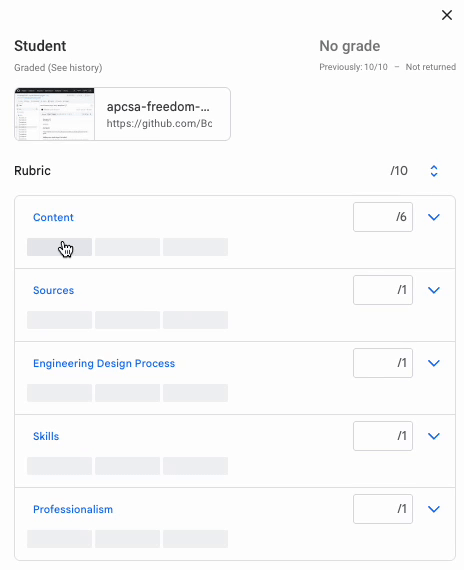
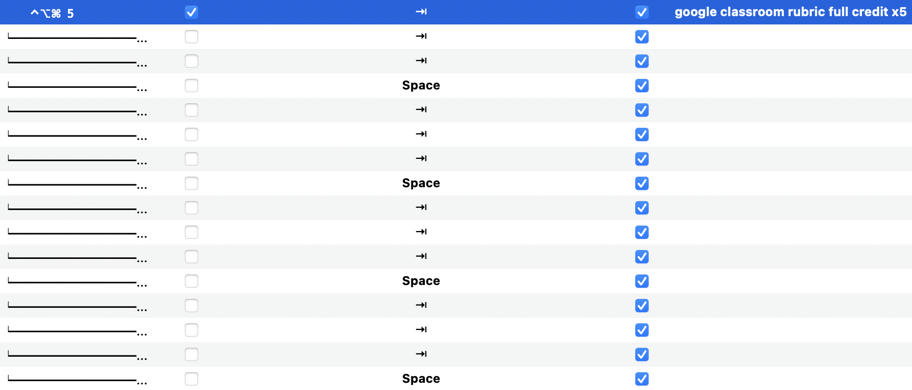
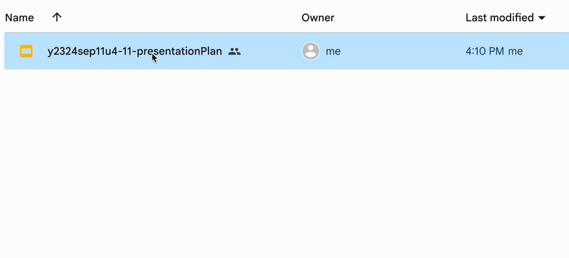
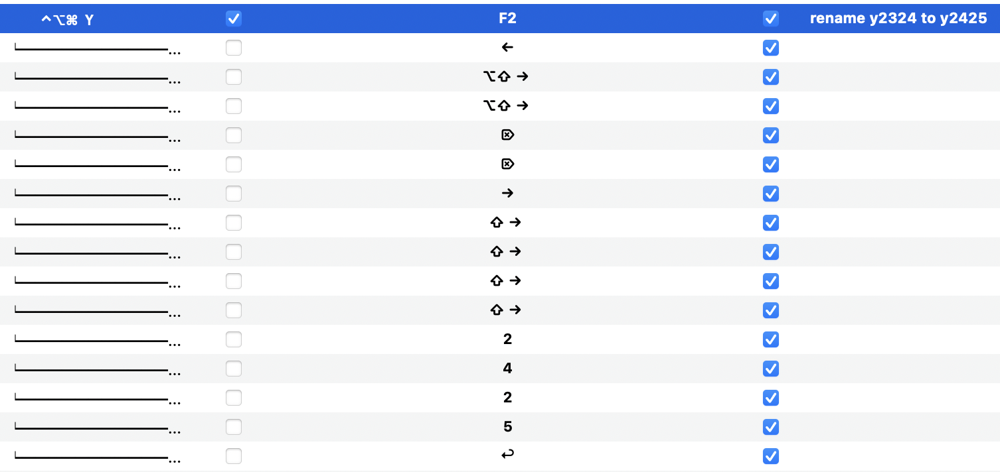
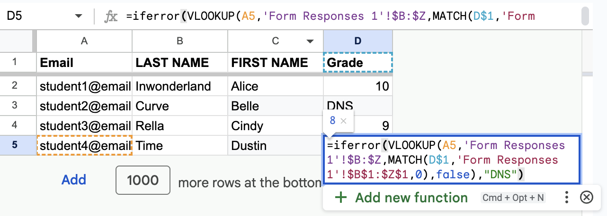
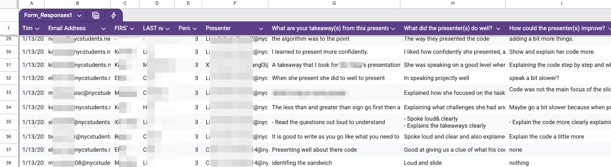
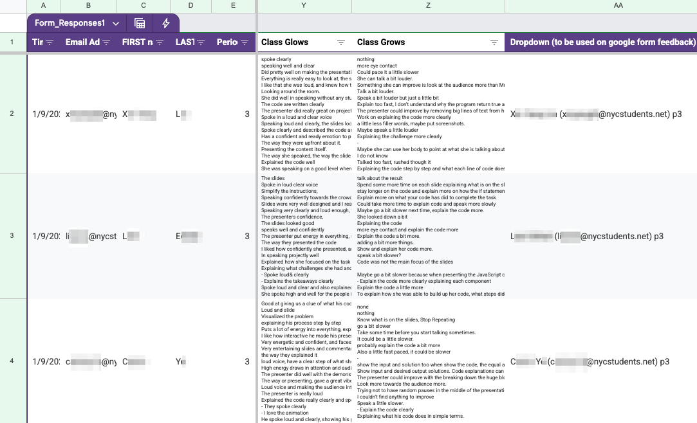
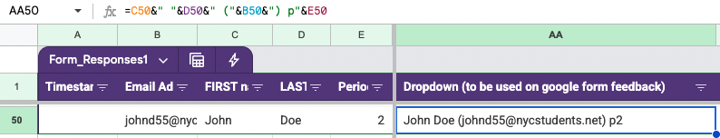
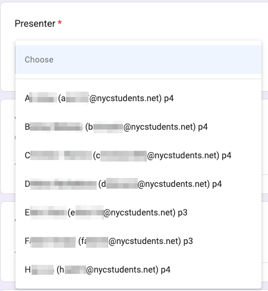

# Session 1: Modern Hacks

## Icebreaker

* Name (pronouns optional)
* Where/what you teach
* What is one small tool, shortcut, or hack (tech or non-tech) that has saved your sanity as a teacher?

### Norms

* Reach out with questions
* Don’t be a hog. Don’t be a log.
* Collaborate collegially
* Take breaks as needed
* Use AI to help you understand/modify/create code!
  * [ChatGPT](https://chatgpt.com/)
  * [Claude AI](https://claude.ai/)
  * [Github Copilot](https://github.com/features/copilot)

---

## Keyboard Shortcuts

[tiny.cc/keyboardshortcuts](https://docs.google.com/document/d/10drl87oaEtmT6E2NQidNY3pKWYNXieEh7Kj-oZ7pDcA/preview?tab=t.0)

* These can help you with the next tool!

## BetterTouchTool

* [Download](https://folivora.ai/)
* 45 day free trial
* $ license is worth it!

_Windows Alternative: [AutoHotkey](https://www.autohotkey.com/)_

#### Ideas

* Automate **full credit** on Google Classroom
  * Click first category
  * Keyboard shortcut trigger script (i.e. <kbd>⌃⌥⌘</kbd>+<kbd>5</kbd>)
  * <kbd>TAB</kbd> x3
  * <KBD>SPACE</kbd>
  * (repeat)
  * You can have multiple versions of these scripts, i.e.
    * <kbd>⌃⌥⌘</kbd>+<kbd>4</kbd> for 4 rows
    * <kbd>⌃⌥⌘</kbd>+<kbd>5</kbd> for 5 rows

<details>
<summary>Expand to see demo & code</summary>





</details>


##### Non-grading, but still useful

* Rename copies of last year's Google Drive files
  * If you use year numbers in your file names, use a script to easily renumber them
  * Make a copy, then use keyboard shortcut to trigger script (i.e. <kbd>⌃⌥⌘</kbd>+<kbd>y</kbd>)
  * In the following example, `Copy of y2324...` gets renamed to `y2425...`. If you have a different format, just think about what your keystrokes would be.
    * <kbd>F2</kbd> to rename
    * <kbd>←</kbd> to go to the beginning of the file name
    * <kbd>⌥⇧→</kbd> x2 to select the next two words ("Copy of")
    * <kbd>⌫</kbd> (`fn+delete`) x2 to delete (and the extra space)
    * [any other keystrokes to change your year numbers]

<details>
<summary>Expand to see demo & code</summary>






</details>


* Reformat Google Slides
* Paste commonly-used text, i.e. emojis, symbols (`⌘`), `System.out.println();`, etc
* Trigger AppleScripts

## AppleScripts

* Think of AppleScripts like BetterTouchTool, but code-based and with more options, i.e. input from the user (you!)
* [Template](template.applescript)
* Clipboard URL > yellkey > Clipboard: [code](yellkey.applescript)
  * Pro tip: use a BTT keyboard shortcut, i.e. * <kbd>⌃⌥⌘</kbd>+<kbd>k</kbd>
* Inserting grades into the gradebook based on student row number: [code](gradebook.applescript)
  * Depends on your spreadsheet/LMS
  * You can loop this a certain number of times (including asking how many times to loop), and/or trigger this with a keyboard shortcut
* Other ideas
  * Manipulating spreadsheets
  * Setting up your "workspace" of windows
  * Automating your per session
* [Other useful AppleScripts](https://github.com/unforswearing/applescript)

## Regex

_NOTE: this will be particularly useful in Session 2_

Regex = "regular expressions". It's a way of matching patterns in a string.

#### Resources

* Lessons: [RegexOne](https://regexone.com/)
* Sandbox: [RegExr](https://regexr.com/)

Regex can be used in Google Sheets formulas! [[learn how](https://www.benlcollins.com/spreadsheets/google-sheets-regex-formulas/)]

## Google Sheets 

### Templates

* [Calendar Template](https://docs.google.com/spreadsheets/d/1bw77ykRaJm5NNImGmGsotg28sbVLZLiW1bNV65BH7do/edit?usp=drive_link)
* [Roster Template](https://docs.google.com/spreadsheets/d/1itw40tzvjnpKQy63nqT2hwHJQ2WTSvcJu1lYdo8kYLo/edit?usp=drive_link)

### Formulas

#### Converting Google Form responses to your roster of students (including missing students)
* [Example](https://docs.google.com/spreadsheets/d/1NyQBR3zch_p65a5xcdBnmAKXaiZzH7s5O57yKhMnPtM/edit?gid=0#gid=0)
* In your `Form Responses 1` sheet, add a column with the header `Grade` (or whatever you want, just make sure the name matches what we eventually add to the next tab). This column can be used to give your students a grade that will show up on your roster.
* Add a new tab to your Google Sheet. This is where you'll paste your roster. 
* Your roster needs to include a column similar to column D (`Grade` or whatever you name it).
* In D2, for example: `=iferror(VLOOKUP(A2,'Form Responses 1'!$B:$Z,MATCH(D$1,'Form Responses 1'!$B$1:$Z$1,0),false),"DNS")`
  * Make sure you update your formula so that the column letters match your roster:
  * `A2` is where the student email address is (collect these on your Google Form)
  * If your `Form Responses 1` sheet has more than 26 columns, you will need to adjust your formula accordingly, i.e. `$B:$AD`.
  * You can use `DNS` (Did Not Submit) or anything else you'd like (i.e. `0`) to indicate that the email address was not found by the `VLOOKUP` in the previous sheet.

<details>
<summary>Expand to see screenshot</summary>



</details>


#### Students giving each other feedback

If you want students to give each other feedback (projects, presentations, etc), this is an easy way to collect all feedback and easily compile/email them. 


<details>
<summary>In a nutshell, we'll collect feedback like this...</summary>



</details>

<details>
<summary>...and end up with something like this (easy to mail merge to students)...</summary>



</details>


How? 
* _Project sheet_
  * This could either be your own sheet created from scratch or one fed from a Google Form where students submit their project.
  * Make a column named "Dropdown" to be used on the next form (as a dropdown). It merges their name (B+C), email (D), and period number (E). Formula: `=C2&" "&D2&" ("&B2&") p"&E2`
  * 
  * GLOWS and GROWS columns
    * In the formula below, change a few things:
      * `URL to Audience Sheet` needs to be updated in BOTH places. Keep the quotes.
      * Change `H:H` to the column where the GLOWS or GROWS are
      * Change `F:F` to the column where the presenter's "Dropdown" name/email is
      * Change `B2` to where the presenter's email is
    * Formula: `=TEXTJOIN(CHAR(10), TRUE, FILTER(IMPORTRANGE("URL to Audience Sheet", "'Form Responses 1'!H:H"), REGEXEXTRACT(IMPORTRANGE("URL to Audience Sheet", "'Form Responses 1'!F:F"), "\(([^)]+)\)") = $B2))`

* _Audience form/sheet_
  * Make a Google Form to collect audience feedback. Use the "Dropdown" name/email from above into this form.
    * 
  * Audience responses will populate a Google Sheet. Copy the URL of this sheet (twice) into the formula above.
  * PRO TIP: copy/paste the feedback into AI and have it flag/filter any inappropriate responses.

[[internal link: projects]](https://docs.google.com/spreadsheets/d/18_RXsiG2Zlqf9OVA31vWB2YqY-FqALyZRppAzdUTLGg/edit?gid=1588290885#gid=1588290885) | [[internal link: audience]](https://docs.google.com/spreadsheets/d/1txf_uy6TWZnj7UG_62K9vNUjTl4BOFOfl3JYoP29OeM/edit?gid=909879936#gid=909879936)

* _Mail Merge_
  * You can then use [FormMule](https://workspace.google.com/marketplace/app/form_mule_email_merge_utility/968670674230) (or any other Mail Merge you want) to send out the feedback. 

<details>
<summary>Here is a sample template:</summary>

```
Dear <<FIRST name>>,

Below is feedback about your PROJECT NAME:

Period: <<Period>>
<B>Grade: <<Grade>>/10</B>

<font color="red">
Teacher's feedback:
<B><<Teacher Feedback>></B>
</font>

---

With the feedback below, take each piece of feedback with a grain of salt, but pay special attention to any repeats/patterns.

<B>Class Glows: </B>
<<Class Glows>>

<B>Class Grows: </B>
<<Class Grows>>

---

If you have any questions, please respond to this email, or we can chat in-person.

TEACHER'S NAME
```

</details>

### String manipulation

* Github repo URL reformatting
  * [Example](https://docs.google.com/spreadsheets/d/1U81ODnEp1MlYGapTVqtg_igRlNraB6bF22eWc9G9WRE/edit?gid=0#gid=0)
  * Assuming column `A` has the repo URL...
  * Column B
    * `B1` can contain the filepath of a file in the repo you want to see, i.e. `prep/plan.md`
    * `B2` would be `=IF(RIGHT($A2,1)="/",$A2&"blob/main/"&B$1,$A2&"/blob/main/"&B$1)`
  * Column C is the clone URL: `="git@github.com:"&right($A2,len($A2)-19)`
  * Column D is the command to clone and rename the repo to the username: `="git clone "&C2&" "&mid(C2,16,FIND("/",C2)-16)`
    * If you want the repo to be named in the format `username-reponame`, add `&"-"&F2` to the end of the formula (and follow the steps below to dynamically get the `reponame`)
  * Column E is the username, which depends on column F: `=MID(A2,find("/",A2,12)+1,len(A2)-20-len(F2))`
  * Column F is the reponame: `=RIGHT(A2,len(A2)-find("/",A2,25))`
  * Column G can be used to insert a filepath if what you need to preview in column H is _not_ `index.html`
  * Column H can be used to preview a website deployed to github pages, putting all the pieces together!: `="http://"&E2&".github.io/"&F2&"/"&G2`

### Apps Script

* Dynamically import Github contributors
  * [Example](https://docs.google.com/spreadsheets/d/1gAyxJ_fvVPwsP2jXve9UKN9sNwh9w1iJXfj2RXrqDw4/edit?gid=0#gid=0)
  * Assuming column `A` has the repo URL...
  * Column B: `=A2&"/graphs/contributors"`
    * This is helpful for when the script doesn't work and you need to manually get the usernames
  * Column C: `=importgithubcontributors(A2)`
  * Script for `importgithubcontributors()`: [[click here](importgithubcontributors.gs)]

## HW

If you don't already know some Python, it would be helpful to learn a bit before Session 2. The more, the merrier! [[click here](../README.md#suggested-hw-before-session-2-python-basics)]

## Back

[Back to HOME](../README.md)