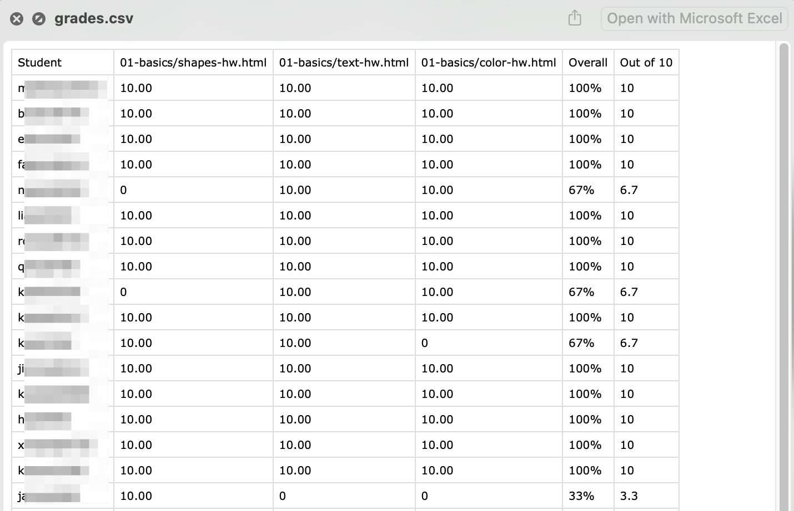
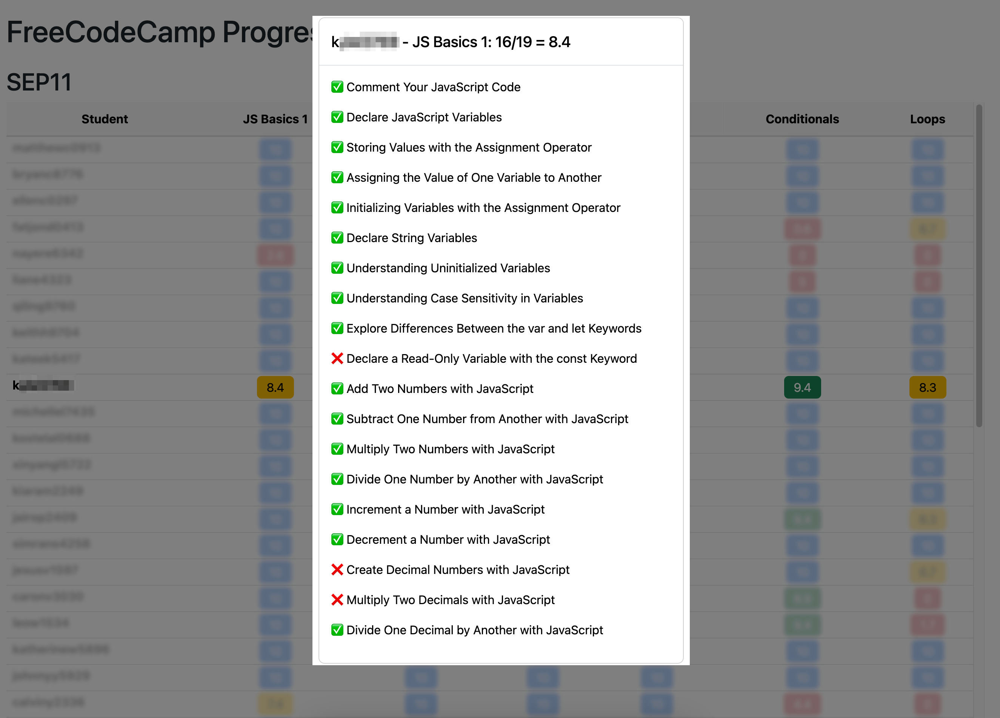

# Session 2: Python for Teachers

## Icebreaker

* Name (pronouns optional)
* Where/what you teach
* If you could have a CSV file of some metric of your own day, what would you like to keep track of? (i.e. macros consumed, minutes spent focused/daydreaming/etc, "Inside Out" emotion dashboard, etc)

### Norms

* Reach out with questions
* Don’t be a hog. Don’t be a log.
* Collaborate collegially
* Take breaks as needed
* Use AI to help you understand/modify/create code!
  * [ChatGPT](https://chatgpt.com/)
  * [Claude AI](https://claude.ai/)
  * [Github Copilot](https://github.com/features/copilot)

---

## Using Python to automate grading

* [Zip Grades to Jupiter Grades](zip_to_jupiter.py)
* [HTML version of zip->jupiter](https://rpremvaree12.github.io/zip-to-jupiter/)

* [CS50 Submit50 / GitHub Classroom to Jupiter](submit50_to_jupiter.py)
* [Python Script to download student work](download_student_work.py)
* [Automate opening each downloaded web project](open_student_websites.py) 

## Pattern matching with Regex > CSV

By using [patterns.py](patterns.py) and [patterns_student_info.json](patterns_student_info.json) with the file tree below, we can use Regex patterns to give completion grades, all in a tidy CSV format. 

<details>

<summary>The CSV will end up looking something like this</summary>



</details>

It helps to then spot check individual student work to check functionality, or even use compare50 (next session) to check plagiarism.

<details>

<summary>Sample file tree</summary>

```
├── github-classroom
│   ├── cs101-2027
│   │   └── web-design-03-12-2025-08-19-37
│   │       ├── student1234
│   │       │   └── 01-basics
│   │       │       ├── index.html
│   │       │       └── style.css
│   │       ├── student5678
│   │       │   └── 01-basics
│   │       │       ├── index.html
│   │       │       └── style.css
│   │       └── student9012
│   │           └── 01-basics
│   │               ├── index.html
│   │               └── style.css
│   └── cs102-2026
│       └── p5js-04-03-2025-09-14-06
│           ├── studentA
│           │   └── shapes
│           │       ├── index.html
│           │       └── sketch.js
│           ├── studentB
│           │   └── shapes
│           │       ├── index.html
│           │       └── sketch.js
│           └── studentC
│               └── shapes
│                   ├── index.html
│                   └── sketch.js
└── patterns
    ├── cs101info.json
    ├── cs102info.json
    └── patterns.py
```


</details>


## Scraping FreeCodeCamp > CSV > HTML dashboard

* **NOTE: The FreeCodeCamp API changed recently, so this currently does NOT work. Hopefully a fix will be coming soon! This message will be deleted if/when it is fixed.**
  * But feel free to use the code that turn the CSV into an HTML dashboard (no API required).
* Students can complete lessons on [FreeCodeCamp.org](http://freecodecamp.org), but it does not have a good "dashboard" view for teachers.
* Clone [this repo](https://github.com/bmuellerhstat/grading/tree/main/fcc-scraper), and follow instructions in the `fcc-scraper` directory:
* Features:
  * Dashboard of grades, grouped by "assignments" defined in your JSON file
  * Click on an assignment to see which lessons are completed/missing
  * Click on a student name to blur the rest (helpful for 1-1 conversations)

<details>

<summary>Click to example of end result</summary>



</details>

## HW

If you don't already know your way around the terminal / command line, it would be helpful to learn a bit before Session 3. The more, the merrier! [[click here](../README.md#suggested-hw-before-session-3-terminal-basics)]


## Back

[Back to HOME](../README.md)
